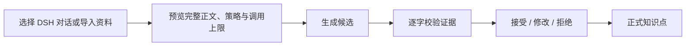

# BetterLearn for DSH

BetterLearn for DSH 是运行在 [DeepSeek Harness（DSH）](https://github.com/deepseek-ai/DeepSeek-Harness) WebUI 中的本地知识提取插件。选择 DSH 历史对话或导入一段资料后，BetterLearn 会生成知识点候选、逐字定位来源证据，再由你决定接受、修改或拒绝。

它使用 DSH 当前选择的模型完成生成，以常驻 Python Core 和独立 SQLite 保存业务数据。没有独立应用，也不读取或迁移旧 Nobei 数据。

## 它能做什么

- 选择一个或多个普通 DSH 历史对话，合并为一次知识点提取任务；
- 导入 TXT、Markdown、有文字层的 PDF，或直接粘贴文本；
- 在 DSH 对话正式提取前查看完整合并正文，只保留用户正文和 DSH 的可见文字回答；
- 在调用模型前预览 L1/L2/L3 提取策略和最大调用次数；
- 短文一次提取，长文先规划再分批处理；
- 为每条候选精确匹配一处或多处原文引用；
- 在审核页修改、接受或拒绝候选，接受后形成正式知识点；
- 通过左边缘、底边或左下角调整浮窗大小，并分别记住各工作页面的尺寸；
- 在默认收起的全局历史栏中重新打开旧任务；
- 通过 SSE 即时更新进度，并保留轮询和页面重连兜底；
- 在本机完成数据库备份、恢复、升级和保留数据卸载。

每个任务会冻结创建时的 provider、model 和 reasoning effort。之后切换 DSH 模型只影响新任务，已有任务的重新提取仍使用原来的模型。

## 一次提取如何完成



界面会依次显示“文档已保存”“正在生成候选”“正在校验证据”“等待审核”。预览、审核、刷新页面和重新连接都不会调用模型；只有开始新任务或显式重新提取才会产生新的模型调用。

## 安装与启动

需要 macOS 或 Linux、Node.js 24、Python 3.12，以及 DSH `0.1.0-rc.7` 或 `0.1.0-rc.8`。当前正式支持预构建 tarball，通过维护 CLI 安装；暂不承诺 npm registry 或 GitHub 源码直装。

把交付包解压后，使用其中的 CLI 安装。以下路径需要替换成你的实际路径：

```bash
BETTERLEARN_CLI="/absolute/path/to/package/bin/betterlearn.mjs"

node "$BETTERLEARN_CLI" install \
  --home "$HOME/.betterlearn" \
  --dsh /absolute/path/to/dsh \
  --dsh-version 0.1.0-rc.8 \
  --python /absolute/path/to/python3.12 \
  --package /absolute/path/to/betterlearn.tgz

node "$BETTERLEARN_CLI" start \
  --home "$HOME/.betterlearn" \
  --port 3000
```

安装命令除注册 DSH 插件外，还会创建 Python 虚拟环境、安装锁定依赖、初始化独立 SQLite 和本机 ownership token。标准 `dsh plugin add` 不能替代这些步骤。

启动后打开 DSH 输出的本地地址。BetterLearn 使用专用 `betterlearn` profile，不修改默认 DSH profile。完整的安装、升级、备份、恢复和卸载命令见 [安装与维护说明](docs/install.md)。

## 第一次使用

1. 在 DSH WebUI 中选择可用的 provider、model 和 reasoning effort。
2. 点击屏幕右侧默认收起的“BetterLearn”按钮，选择知识来源：DSH 对话、文件或粘贴正文。结果页默认约 `460px` 宽；可拖动左边缘、底边或左下角调整宽高。
3. 如果选择 DSH 对话，可搜索并勾选一个或多个相关普通对话。确认完整合并正文、提取策略和最大模型调用次数后，点击“开始提取”。
4. 等待候选生成和证据校验完成。长文会串行执行多个批次。
5. 在审核页核对高亮原文，选择“接受”“修改后接受”或“拒绝”。
6. 全部审核完成后查看正式知识点；需要时可直接修改标题和详细内容并保存。
7. 历史栏中的待审查、已完成和失败任务可确认后删除；正在提取的任务需在进度页选择“终止并删除”。

真实模型调用可能收费。模型已经返回，但输出格式或证据没有通过校验时，provider 仍可能计费。

## 如何确认安装可用

满足下面这些结果，说明最小闭环已经正常工作：

- `install` 输出 `Installed BetterLearn`，`start` 能启动专用 DSH WebUI；
- 右侧 BetterLearn 按钮默认收起，点击后能在不挤压 DSH 对话区的浮动小窗中选择 DSH 对话、导入文件或粘贴原文；
- DSH 对话支持搜索和多选，正式提取前必须显示完整合并预览；预览内容不含系统提示、推理、工具、插件注入或子 Agent 内容；
- 结果页默认保持窄窗，调整后的尺寸在刷新后恢复；小窗口会压缩字体与间距，大窗口不会无限放大文字；
- 历史在窄窗内以抽屉方式打开，不再为了历史强制扩大整个浮窗；
- 预览页显示提取策略和调用上限，且预览本身不调用模型；
- 点击“开始提取”后，进度最终进入“等待审核”；
- 候选的引用可以在原文中逐字高亮；
- 接受候选后会出现对应的正式知识点；
- 正式知识点可在结果页继续编辑；首次编辑会从“已接受”重新计入“已修改”，模型原始候选保持不变；
- 删除任务会同时删除该任务的原文、候选、审核、知识点和事件；没有回收站或版本历史；
- 刷新或重新连接能恢复当前任务，且不会额外调用模型。

仓库级构建、测试及 P2/P3/P4 验收标准见 [验证说明](docs/validation.md)和 [交付验收](docs/delivery-plan.md)。

## 常见问题

### 长时间停在“正在生成候选”怎么办？

长文会先规划，再串行提取多个批次；模型停止计费或最后一次返回后，本地仍可能继续解析结果和校验证据。保持 DSH 进程运行即可，页面重新连接不会重新调用模型。若界面明确进入失败状态，再按提示检查模型配置或新建任务。

### 为什么显示“模型返回的结果不符合提取格式”？

模型输出必须通过候选 Schema 和证据规则。格式无效时，本次不会保存候选，但已经完成的 provider 调用仍可能收费。显式“重新提取”会从头执行整个计划并再次调用模型；切换 DSH 模型只会影响新任务。

### PDF 为什么无法导入或没有内容？

当前只解析 PDF 文字层，不提供 OCR，也不读取页面图像。扫描件需要先在其他工具中完成 OCR，再导入生成的文本。PDF 文件上限为 5 MiB，规范化正文上限为 512 KiB。

### 从 DSH 对话提取时会读取哪些内容？

BetterLearn 只列出普通 DSH 对话。用户主动选择后，Host 通过 DSH 的会话查询接口按原始追加事件读取，并只接受用户消息中的文字正文和 DSH 助手消息中的可见文字回答。系统提示、内部推理、工具调用与结果、插件注入上下文、图片及其他非文字块、子 Agent 对话都不会进入预览或提取正文。

多个相关对话按列表顺序合并成一个任务，最多选择 50 个，合并后的 UTF-8 正文上限为 512 KiB；超过上限时不会截断，必须减少选择。提交前 Host 会重新读取并核对预览摘要；内容有变化时必须重新预览。

### 能把 BetterLearn 装进日常编码 profile 吗？

当前交付使用专用 profile。随包配置会关闭该 profile 的部分重试、标题生成和编码工具，并限制 workflow 并发，以保证提取闭环行为稳定。不要直接把这些配置叠加到日常编码环境，具体影响见 [专用 profile 的能力范围](docs/install.md#专用-profile-的能力范围)。

## 架构

```text
DSH CLI
  └─ DSH WebUI
       ├─ DSH 对话界面
       └─ document.body → BetterLearn 浮动 Client
            └─ /nobei/v1/*
                 └─ BetterLearn Host
                      └─ stdio JSON-RPC
                           └─ Python Core
                                └─ 独立 SQLite
```

Host 位于 `src/product`，注入 DSH 的 agents、llm、sessionQuery、subprocess、tools、webServer 和 workflowEngine；Web 客户端位于 `src/client`，直接挂载到 `document.body`，以右侧按钮控制独立浮窗；Python Core 位于 `python/nobei_core`，通过 stdio JSON-RPC 常驻运行。

详细边界见 [架构说明](docs/architecture.md)，当前验证范围见 [验证说明](docs/validation.md)，后续工作见 [路线图](docs/roadmap.md)。

## 数据与项目边界

- 当前产品是单机单用户本地插件，不是独立应用；
- 只使用产品自有的 11 张表，新库从最终产品 Schema 干净创建；
- 正式数据库、真实 provider 响应和历史验收 evidence 不随仓库分发；
- 数据与旧 Nobei 始终隔离，不读取、合并、迁移或自动删除旧数据；
- PDF 只保存规范化正文，不保存原 PDF；
- DSH 对话任务只保存经过白名单过滤的合并正文和来源标签，不保存被排除的宿主内部上下文；
- 仓库不包含 `node_modules`、虚拟环境和构建产物。

内部 npm 包名与 Python 模块名暂时保留 `@nobei/dsh-phase1` / `nobei_core`，避免与功能无关的大范围重命名。独立产品与仓库名称是 `betterlearn-for-dsh`。

## 开发

依赖基线为 DSH `0.1.0-rc.7`、Node.js 24、pnpm 11.23 和 Python 3.12。

```bash
CI=true corepack pnpm@11.23.0 install --frozen-lockfile
corepack pnpm@11.23.0 build
corepack pnpm@11.23.0 test
corepack pnpm@11.23.0 test:phase1b-python
```

首次 checkout 或依赖声明变化后先执行安装。`CI=true` 允许无交互终端同步旧 `node_modules`；`--frozen-lockfile` 仍会阻止锁文件漂移。否则可能在依赖准备阶段遇到 `ERR_PNPM_ABORTED_REMOVE_MODULES_DIR_NO_TTY`，详见[开发环境准备与首次运行](docs/validation.md#开发环境准备与首次运行)。

生成预构建安装包：

```bash
corepack pnpm@11.23.0 pack:acceptance
```

普通构建和测试不会调用真实模型。历史真实模型验证已经封存，当前交付验收使用 fake provider。

## 许可证

BetterLearn for DSH 采用 [MIT License](LICENSE) 开源。公开 Git 仓库用于查看、审计和协作，不改变已经验收的 tarball 安装路径。

## Model Experience

### 规划与候选提取

#### What the model sees

用户开始提取时，Host通过DSH的`ctx.llm.resolveCallConfig`解析模型配置，由Core冻结provider、model与reasoning effort。实际生成由`workflowEngine`执行`agent(prompt, { schema })`，每次规划或提取创建独立的父/子Agent；配置解析本身不是一次候选生成。切换DSH模型只影响新任务，已有任务重试仍沿用冻结的选择。

插件显式提供两类输入：规划请求包含当前容器各块的ID和正文，要求按顺序完整分组；提取请求包含当前正文范围、逐字引用证据的规则，以及`structured_output`候选Schema。L1直接提供全文，L2/L3逐组提供正文，L3另有边界范围提取。PDF先在本地解析为规范化文字，不把原PDF或页面图像交给模型。只有用户显式选择 DSH 历史对话时，插件才会把白名单过滤后的用户正文与 DSH 可见回答合并为当前任务材料；不会把系统提示、推理、工具、插件上下文或子 Agent 内容拼入材料。最终请求仍由DSH组装其系统上下文和工具说明。

当前新任务的`l1-v3`提示词要求选择主要且不重复的知识点、遵守字段数量和长度限制，并原样复制quote。兼容DSH所需的Schema转换会把其不支持的数量/长度关键字写进字段description；返回后仍由完整契约校验。提取Agent只允许`structured_output`，不能执行bash、读写文件或其他工具。具体请求构造见 [generation-adapter.ts](src/product/generation-adapter.ts)，字段约束见 [候选契约](contracts/l1-candidate.schema.json)。

#### Token effect

L1每次提取最多1次模型调用；L2/L3包含规划和分批提取，界面预览的`maxCalls`是整个计划的上限，不是已发起次数或最终提取批数。实际分组决定调用数量，失败时可能提前停止。规划与提取会重复发送相应正文，L3重叠容器和边界也会产生重复输入；字符分块预算不是精确token估算。路由与上限计算见 [P3提取契约](docs/p3-extraction-contract.md)。

每次生成请求设置`maxTokens=32768`，推理与结构化答案共用该输出预算；这不是承诺用满的数量，也不是费用上限。材料长度、批次、模型和推理档位都会影响实际用量。模型已返回但格式或证据未通过校验时，已发生的调用仍可能收费。格式错误或无效规划导致整个attempt失败时，不保存此前批次的候选；证据定位阶段则决定哪些候选及证据可以进入审核。仅用户显式“重新提取”才重跑整个计划，不续接此前成功批次。正文预览、审核、SSE进度、轮询、页面刷新及重新连接不发起提取调用。

#### KV Cache effect

各次规划/提取是独立请求，插件不维护或复用跨批次的模型KV缓存，不把前批上下文累计到下一批。相同提示词和工具定义可能形成可复用的请求前缀，但正文、任务提示词版本、Schema说明或宿主上下文变化会改变请求内容；规划和提取也不是同一份前缀。缓存是否命中、可复用长度以及计费由DSH实际组装的请求和provider决定，不能承诺缓存命中或固定节省比例。

## Known Limitations and Deferred Work

- 当前只支持单机单用户macOS/Linux上的DSH Web插件，安装需维护CLI完成Python与数据目录初始化；预构建tarball是当前交付渠道，不承诺npm包名或Git源码直接安装。公开仓库采用MIT许可证，但源码公开不改变已经验收的安装路径。
- BetterLearn 浮窗不占用 DSH 的标签页或对话布局；但随包的patch会修改专用profile中的工具、重试和workflow设置。不要把它直接叠加到日常编码profile；具体影响见 [专用profile限制](docs/install.md#专用-profile-的能力范围)。
- PDF只支持文字层，无OCR；证据定位针对保存的规范化正文，不保证原PDF版面坐标。正文上限512KiB、PDF文件上限5MiB；不保存原PDF。
- DSH 对话导入只支持普通会话中的用户/助手可见文字；最多选择50个，合并正文上限512KiB，不截断、不增量同步，内容变化后必须重新预览。
- 每次提取调用最多20条候选，长文按多批汇总；精确quote匹配不等于知识点语义正确或覆盖完整，仍需人工审核。fake验收和有限真实试用不代表任意模型、任意材料的质量保证，已验证范围见 [验证说明](docs/validation.md)。
- 配置由维护CLI提供，Host导出Schemastery `Config`供Cordis加载与更新时校验。Python路径、数据目录与ownership token均属于本机安装，保持必填，不生成通用默认值。客户端通过`inject.hooks`订阅模型目录；尚未提供插件设置卡片。
